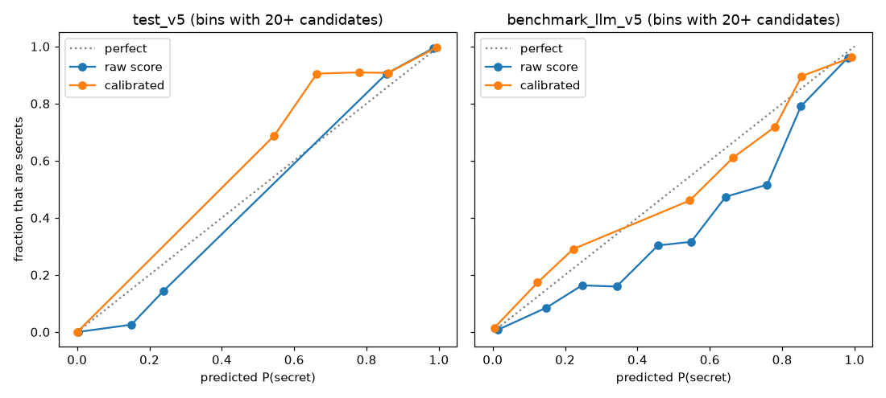

# Detector report: secret types and calibration

Detector v1.2 (model v17). Covers FR-CORE-02 (per-type precision and recall) and FR-CORE-03 (calibrated confidence). Overall precision and recall at each layer threshold (FR-CORE-06) are in the [README](../README.md) and `cli/Harpocrates/ml/models/model_config.json`.

All numbers come from held-out sets: `test_v5` (42 untouched repos) and `benchmark_llm_v5` (secrets written by model families never used in training). The calibration map below was fit on the validation split only (DATA-09). The type rules were developed on the validation split, with one caveat: the first per-type run, which showed the problem, was on `test_v5`. The new rules encode public token formats and connection-string syntax, not anything fitted to that set. After the rules were final, both held-out sets were scored once, then once more after a code-review fix that made the line check run in linear time. That second run moved type agreement by 0.1 point.

## Secret types (FR-CORE-02)

Every finding carries one of six types, which the read tool puts in its placeholder (`<<HARPO:api_token:3f9a>>`): `cloud_key`, `api_token`, `db_credential`, `private_key`, `password`, `generic`.

Reproduce: `python bench/per_type_report.py data/eval/test_v5.jsonl data/eval/benchmark_llm_v5.jsonl`

- **Recall** for a type is the share of labeled secrets of that type that some finding overlaps.
- **Precision** for a type is the share of findings reported with that type that overlap a real secret, of any type.
- **Type agreement** is the share of caught secrets reported with their true type.

**test_v5**

| Type | Secrets | Commit recall | Gate recall | Findings (gate) | Precision (gate) |
| --- | --- | --- | --- | --- | --- |
| cloud_key | 253 | 99.6% | 100.0% | 243 | 95.5% |
| api_token | 897 | 99.8% | 99.9% | 879 | 98.1% |
| db_credential | 212 | 99.5% | 100.0% | 268 | 100.0% |
| password | 63 | 79.4% | 87.3% | 21 | 100.0% |
| generic | 75 | 97.3% | 98.7% | 465 | 86.2% |
| private_key | 0 | n/a | n/a | 0 | n/a |

Type agreement: 82.3% at commit, 82.0% at gate.

**benchmark_llm_v5**

| Type | Secrets | Commit recall | Gate recall | Findings (gate) | Precision (gate) |
| --- | --- | --- | --- | --- | --- |
| cloud_key | 312 | 98.7% | 99.4% | 305 | 89.2% |
| api_token | 1,279 | 97.3% | 97.6% | 1,301 | 89.9% |
| db_credential | 256 | 91.0% | 92.6% | 329 | 91.5% |
| password | 111 | 65.8% | 73.9% | 36 | 100.0% |
| generic | 106 | 76.4% | 78.3% | 694 | 81.1% |
| private_key | 0 | n/a | n/a | 0 | n/a |

Type agreement: 81.3% at commit, 80.9% at gate.

**How to read these numbers**

- **Passwords are the weak type.** 66–87% of them are caught. Many are short, word-like strings passed straight into a call (`client.connect("...")`) with no name nearby, which is the hardest case for any detector.
- **Few findings say `password`, and many say `generic`.** The eval generator deliberately assigns secrets to misleading names: a password stored in `client_secret`, or an AWS key in `accessToken`. A bare random string has no evidence of its true type. In those cases the detector reports the type the name suggests, or `generic`. Most of the remaining type disagreement is this case.
- **Neither held-out set has private keys.** PEM blocks are covered by the canary repo instead: `test_fr_read_01_safe_read_canary_repo_zero_leaks` reads a planted PEM private key and leaks none of it. That is a pass/fail check, not a precision or recall figure.

**What changed in this release**

Type agreement on the validation split went from 64.7% to 82.3%, and recall didn't change. Types never feed the model, so they can't change what is detected.

- **Provider formats with no detection regex** now set the type even when the variable name says otherwise: GitHub fine-grained tokens, DigitalOcean tokens, Vault tokens, Twilio SIDs, and Discord bot tokens.
- **A value inside a connection string** reports that string's type. A password inside a JDBC URL is `db_credential`, and an `AccountKey` inside an Azure storage string is `cloud_key`.
- **Hex blobs and symmetric keys are now `generic`, not `private_key`.** This covers `hmac_key`, `aes_key`, and bare 32-character hex. A Twilio auth token and an AES-128 key look identical. `private_key` now means asymmetric key material: PEM blocks, SSH keys, and `private_key` or `rsa_key` names.

The type also feeds severity, so a few findings change severity band. Which findings are reported doesn't change.

**Placeholder note (trade-off).** The read tool's placeholders carry the type, so these changes are visible to the agent. A hex key that used to come back as `<<HARPO:private_key:…>>` now comes back as `<<HARPO:generic:…>>`. The placeholder format and the hashing are unchanged. The trade-off is less specific labels for hex keys, in exchange for never calling a 32-character API token a private key.

## Calibrated confidence (FR-CORE-03)

An ML-verified finding's `confidence` is the model's probability that the candidate is a secret, mapped through an isotonic calibration curve. The curve was fit on validation candidates and is stored in `model_config.json` under `calibration`. Like the rest of that file, it is covered by the hash manifest.

The routing thresholds still apply to the raw score. Calibration changes the number reported with each finding, never which findings are reported.

Reproduce: `python scripts/calibrate.py` (add `--write` to refit the shipped map).

| Set | Candidates | ECE, raw score | ECE, calibrated |
| --- | --- | --- | --- |
| validation (fit set) | 12,455 | 0.0243 | 0.0013 |
| test_v5 | 6,175 | 0.0076 | 0.0039 |
| benchmark_llm_v5 | 3,503 | 0.0287 | 0.0234 |

ECE is the expected calibration error over 10 equal-width bins. The plot leaves out bins with fewer than 20 candidates.

**Limits**

- **A probability only holds for a similar mix of candidates.** These sets are about 20% secrets. Real repositories have far fewer, so on ordinary code the true share of secrets at a given confidence is lower than the number shown.
- **On the benchmark, mid-range scores still don't match outcomes well.** The map was fit on validation data, and secrets written by unseen model families behave differently there. Treat a confidence between 0.3 and 0.8 as "uncertain", not as an exact rate.
- **Regex findings keep fixed confidences** of 0.99 for critical patterns and 0.95 for high ones. Measured precision of regex-caught secrets is 96.4% on `test_v5` and 90.9% on the benchmark, so the fixed 0.99 overstates them. The benchmark's look-alike non-secrets, such as fake keys that match a provider's format, account for most of the gap. Those constants also set severity, so they stay unchanged for now.
