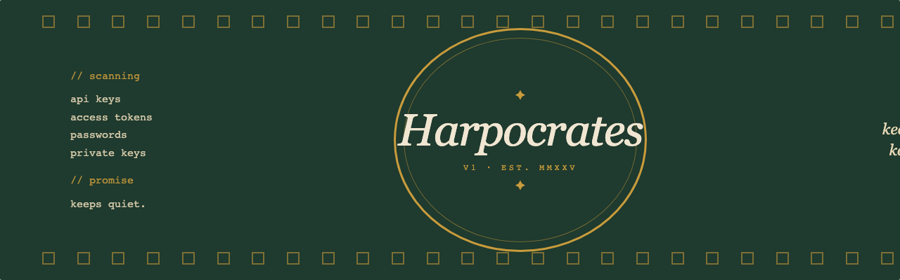
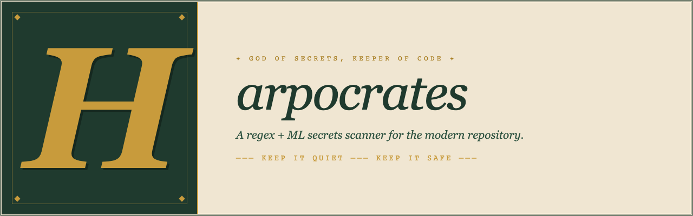
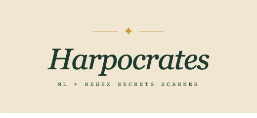
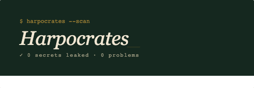
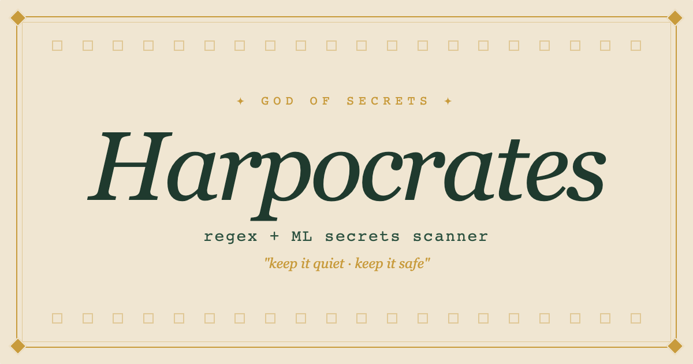
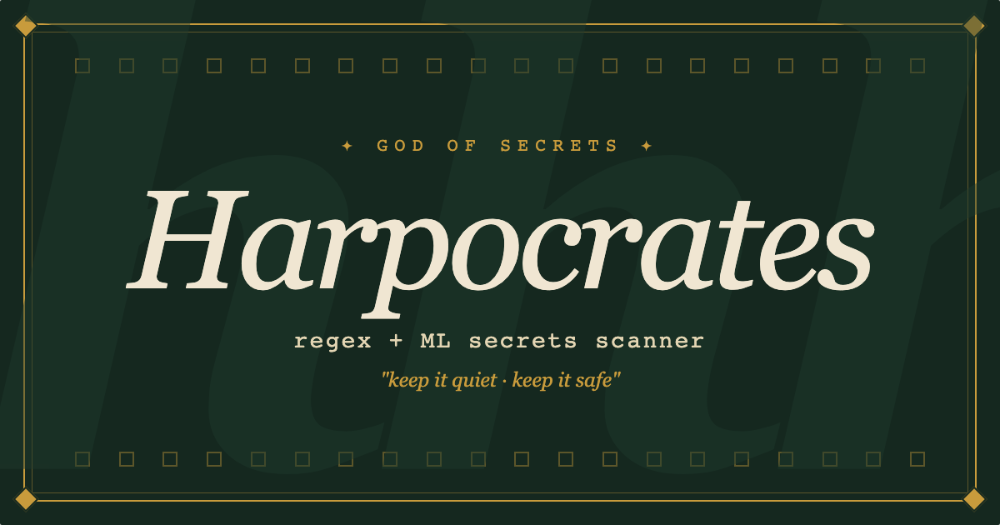
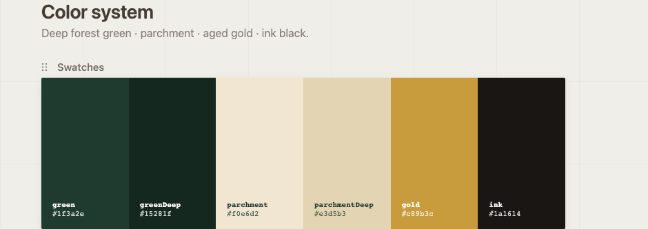

# Harpocrates Brand Assets

All images extracted from the brand design document. Copy-paste the markdown snippets below into your README.

---

## Hero Banners (1280×400)

Pick one for the top of your README.

**A · Classic Parchment**
```md

```


---

**B · Dark + Stars**
```md

```


---

**C · Tondo Medallion**
```md

```


---

**D · Illuminated Manuscript**
```md

```


---

**E · Type Poster**
```md

```


---

## Logo Lockups

Use these anywhere a "logo" is needed — pure-type, no external assets required.

**Horizontal**
```md

```


---

**Stacked Medallion**
```md

```


---

**Wordmark Only**
```md

```


---

**Terminal**
```md

```


---

**Badge**
```md

```


---

## Section Dividers (1280×120)

Drop these between README sections. Light and dark variants available.

**Installation**
```md

```


**Usage**
```md

```


**Configuration**
```md

```


**How it scans**
```md

```


**Contributing**
```md

```


**License**
```md

```


**Installation · Dark**
```md

```


**Usage · Dark**
```md

```


---

## Social / OG Cards (1200×630)

For GitHub social preview (`Settings → Social preview`) or Twitter/LinkedIn sharing.

**Parchment**
```md

```


**Dark**
```md

```


---

## Color Palette

```md

```


| Token | Hex |
|---|---|
| `green` | `#1f3a2e` |
| `greenDeep` | `#15281f` |
| `parchment` | `#f0e6d2` |
| `parchmentDeep` | `#e3d5b3` |
| `gold` | `#c89b3c` |
| `ink` | `#1a1614` |
